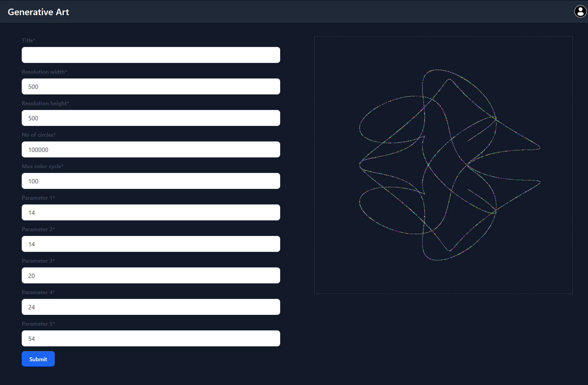

# generative-art
Generate art based on mathematical equations


## Installation
windows:
```
pip install pipenv
pipenv install
```
<p>for other os use this <a href="https://pypi.org/project/pipenv/#installation">documentation</a> to install pipenv. </p>

## Configuration
```
cd generative_art
python manage.py migrate
python manage.py runserver
```

## Sample pattern
